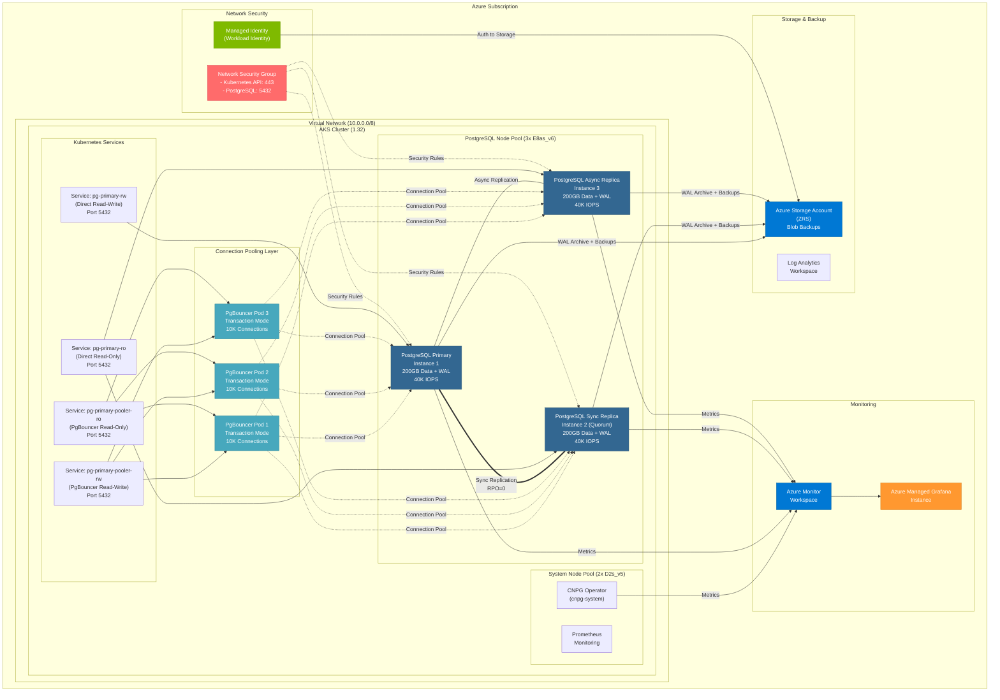

# 🚀 Azure PostgreSQL HA on AKS Workshop

**Version**: `v1.0.0` | **License**: MIT | **Status**: Lab & PoC Ready

A complete automation framework for deploying a **highly available PostgreSQL database** on Azure Kubernetes Service with Premium v2 storage, CloudNativePG operator, and PgBouncer connection pooling.

> **⚠️ IMPORTANT: Lab and Proof-of-Concept Use Only**  
> This code is provided strictly for **lab environments and proof-of-concept purposes only**. It is not intended for production use. Additional hardening, security reviews, compliance validation, and operational procedures are required before considering any production deployment.

[](#) [](#) [](#) [](#) [](#) [](#) [](#) [](#) [](#)

---

## 🏗️ Architecture Overview


### Architecture Diagram


## ✨ Key Features

### 🔧 Infrastructure & Deployment
- **Full Automation**: Pure Azure CLI scripts following Microsoft reference implementation
- **Separate Node Pools**: 2 system nodes (D4s_v5) + 3 user nodes (E8as_v6) for workload isolation
- **Zone Redundancy**: Deployment across 3 Azure Availability Zones
- **Premium Storage**: Premium SSD v2 with 40K IOPS & 1,250 MB/s per disk (200 GiB)
- **DevContainer Ready**: Pre-configured environment with all tools installed

### 🛡️ High Availability & Reliability
- **3-Node Cluster**: 1 primary + 1 quorum sync replica + 1 async replica
- **Automatic Failover**: <10 second RTO with zero data loss (RPO = 0)
- **Data Durability**: Synchronous replication with remote_apply guarantee
- **Connection Pooling**: 3 PgBouncer instances handling 10,000+ concurrent connections
- **Health Monitoring**: Automated health checks with self-healing capabilities

### 📊 Performance & Scalability
- **Target Throughput**: Optimized for 8,000-10,000 TPS
- **Dynamic Resources**: PostgreSQL parameters auto-calculate from memory allocation
- **Efficient Pooling**: Transaction-mode pooling for optimal connection management
- **Load Balancing**: Automatic read distribution across replicas

### 🔐 Security & Compliance
- **Workload Identity**: Federated credentials (no secrets in pods)
- **Authentication**: SCRAM-SHA-256 password encryption
- **Network Security**: NSGs, private networking, NAT Gateway
- **Encryption**: At-rest and in-transit encryption
- **RBAC**: Kubernetes role-based access control

### 📈 Observability & Operations
- **Grafana Dashboards**: Pre-built dashboard with 9 monitoring panels
- **Prometheus Metrics**: Real-time cluster health and performance metrics
- **Azure Monitor**: Centralized log aggregation and alerting
- **CloudNativePG**: 1.27.1 operator for automated lifecycle management

### 💾 Backup & Recovery
- **Automated Backups**: WAL archiving + base backups to Azure Blob Storage
- **7-Day Retention**: Configurable backup retention policies
- **Point-in-Time Recovery**: PITR capability via WAL archives
- **Geo-Redundancy**: Optional GRS for disaster recovery

---

## 🚀 Quick Start

### Option A: Use DevContainer (Recommended) 🐳

All tools pre-installed in isolated container:

```bash
# Requirements: Docker Desktop + VS Code Remote - Containers extension
# 1. Open project in VS Code
# 2. Ctrl+Shift+P -> "Dev Containers: Reopen in Container"
# 3. Wait for build (2-5 min first time)
# 4. Tools ready: az, kubectl, helm, jq, openssl
```

See `.devcontainer/README.md` for detailed setup.

### Option B: Local Installation

**Prerequisites**:
- Azure CLI (v2.56+), kubectl (v1.21+), Helm (v3.0+), jq, OpenSSL
- Azure subscription with Owner or User Access Administrator role
- Region with Premium v2 disk support

### 1️⃣ Configure
```bash
# Clone repository
git clone <repo-url>
cd azure-postgresql-ha-aks-workshop

# Review and customize environment variables
code config/environment-variables.sh
```

### 2️⃣ Deploy
```bash
# Load environment variables into current shell session
# This makes all configuration values available to deployment scripts
source config/environment-variables.sh

# Deploy all components (7 automated steps)
./scripts/deploy-all.sh
```

> **What does this do?** The `source` command loads all configuration variables (like resource names, regions, VM sizes) from the config file into your current terminal session. This allows the deployment scripts to access these values without hardcoding them.

### 3️⃣ Verify
```bash
# Get cluster credentials
az aks get-credentials --resource-group <rg-name> --name <cluster-name>

# Check status
kubectl cnpg status pg-primary -n cnpg-database

# View pods
kubectl get pods -n cnpg-database -l cnpg.io/cluster=pg-primary
```

### 4️⃣ Validate Deployment
```bash
# Run comprehensive cluster validation
./scripts/07a-validate-cluster.sh
```

**What gets validated:**
- ✅ Cluster status and HA configuration
- ✅ Multi-zone pod distribution
- ✅ Service endpoints  
- ✅ PostgreSQL connectivity (primary and replicas)
- ✅ Data replication (RPO=0)
- ✅ PgBouncer pooler (3 instances)
- ✅ WAL archiving and backups
- ✅ Monitoring configuration

### 5️⃣ Connect
```bash
# Option 1: Connect via PgBouncer (Recommended for Applications)
kubectl port-forward svc/pg-primary-pooler-rw 5432:5432 -n cnpg-database &
psql -h localhost -U app -d appdb

# Option 2: Direct connection to PostgreSQL
kubectl port-forward svc/pg-primary-rw 5432:5432 -n cnpg-database &
psql -h localhost -U app -d appdb
```

**Why use PgBouncer?**
- Handles 10,000+ concurrent connections efficiently
- Reduces PostgreSQL connection overhead
- Transaction-level pooling for optimal performance
- Automatic load distribution across replicas

---

### 📋 Documentation

| Document | Description |
|----------|-------------|
| 📖 [**SETUP_COMPLETE.md**](docs/SETUP_COMPLETE.md) | 👈 **START HERE** - Complete setup guide |
| ⚡ [**QUICK_REFERENCE.md**](docs/QUICK_REFERENCE.md) | Command cheat sheet |
| 💰 [**COST_ESTIMATION.md**](docs/COST_ESTIMATION.md) | Hourly/monthly cost breakdown (~$2,873/month) |
| 📊 [**GRAFANA_DASHBOARD_GUIDE.md**](docs/GRAFANA_DASHBOARD_GUIDE.md) | Dashboard usage and metrics |
| 🔄 [**FAILOVER_TESTING.md**](docs/FAILOVER_TESTING.md) | High availability testing |

### ⚙️ Configuration
```
config/
└── environment-variables.sh   - Bash environment configuration
    - Resource names with random suffix
    - AKS settings (version, VM sizes)
    - Storage configuration (IOPS, throughput)
    - PostgreSQL parameters
    - Auto-detect public IP for firewall
```

### 🚀 Deployment Scripts
```
scripts/
├── 02-create-infrastructure.sh         - Creates Azure resources (RG, AKS, Storage, Identity, Bastion, NAT Gateway)
├── 03-configure-workload-identity.sh   - Sets up federated credentials
├── 04-deploy-cnpg-operator.sh          - Installs CloudNativePG operator via Helm
├── 04a-install-barman-cloud-plugin.sh  - Installs Barman Cloud Plugin for backup/restore
├── 04b-install-prometheus-operator.sh  - Installs Prometheus Operator for metrics collection
├── 05-deploy-postgresql-cluster.sh     - Deploys PostgreSQL cluster + PgBouncer pooler + PodMonitor
├── 06-configure-monitoring.sh          - Configures Grafana + Azure Monitor
├── 07-display-connection-info.sh       - Displays connection endpoints and credentials
├── 07a-validate-cluster.sh             - ⭐ Validates deployment (connectivity, replication, HA)
└── deploy-all.sh                       - Master orchestration script (8 steps)
```

### ⚙️ Kubernetes Reference
```
kubernetes/
└── postgresql-cluster.yaml - Reference manifest (NOT used in deployment)
    - See scripts/05-deploy-postgresql-cluster.sh for actual deployment
    - Configuration values loaded from environment variables
```

### � Repository Structure

```
📦 azure-postgresql-ha-aks-workshop/
├── 📄 README.md                        # Main project documentation
├── 📄 00_START_HERE.md                 # Quick start guide
├── 📄 CONTRIBUTING.md                  # Contribution guidelines
├── 📄 LICENSE                          # MIT License
│
├── 📂 config/                          # Configuration files
│   └── environment-variables.sh        # Bash environment config
│
├── 📂 scripts/                         # Deployment automation
│   ├── deploy-all.sh                   # Master orchestration (8 steps)
│   ├── 02-create-infrastructure.sh     # Azure resources
│   ├── 03-configure-workload-identity.sh
│   ├── 04-deploy-cnpg-operator.sh
│   ├── 04a-install-barman-cloud-plugin.sh
│   ├── 04b-install-prometheus-operator.sh
│   ├── 05-deploy-postgresql-cluster.sh
│   ├── 06-configure-monitoring.sh
│   └── 07-display-connection-info.sh
│
├── 📂 kubernetes/                      # K8s manifests
│   └── postgresql-cluster.yaml         # Reference manifest
│
├── 📂 grafana/                         # Grafana dashboards
│   └── grafana-cnpg-ha-dashboard.json  # PostgreSQL HA dashboard
│
├── 📂 docs/                            # Comprehensive documentation
│   ├── README.md                       # Full technical guide
│   ├── SETUP_COMPLETE.md               # 👈 Start here
│   ├── QUICK_REFERENCE.md              # Command cheat sheet
│   ├── COST_ESTIMATION.md              # Budget planning
│   ├── PRE_DEPLOYMENT_CHECKLIST.md     # Pre-flight checks
│   ├── AZURE_MONITORING_SETUP.md       # Monitoring setup
│   ├── GRAFANA_DASHBOARD_GUIDE.md      # Dashboard usage
│   ├── IMPORT_DASHBOARD_NOW.md         # Dashboard import
│   ├── FAILOVER_TESTING.md             # HA testing
│   └── VM_SETUP_GUIDE.md               # Load test VM
│
└── 📂 .github/
    └── copilot-instructions.md         # AI assistant context
```

---

## 🎓 How to Use This Project

### Phase 1: Understanding (10 mins)
1. Read `docs/SETUP_COMPLETE.md` - Overview and prerequisites
2. Review `docs/QUICK_REFERENCE.md` - Command reference
3. Check `docs/COST_ESTIMATION.md` - Budget planning
4. Skim `docs/README.md` - Full capabilities

### Phase 2: Preparation (15 mins)
1. Verify prerequisites installed (az, kubectl, helm, jq)
2. Update `config/environment-variables.sh`
3. Change PostgreSQL password in environment variables
4. Verify region support for Premium v2

### Phase 3: Deployment (20 mins)
1. Load environment: `source config/environment-variables.sh`
2. Run `./scripts/deploy-all.sh`
3. Monitor deployment progress (7 automated steps)
4. Verify cluster health

### Phase 4: Validation (10 mins)
1. Check pods are running
2. Test PostgreSQL connection
3. Verify backups to storage
4. Access Grafana dashboard
5. Run pgbench test: `./scripts/08-test-pgbench.sh`

### Phase 5: Operation (Ongoing)
1. Monitor cluster metrics
2. Test backup/restore
3. Scale as needed
4. Apply updates

---

## � Connection Pooling with PgBouncer

### Architecture
The deployment includes **3 PgBouncer instances** for high-availability connection pooling:

| Component | Configuration |
|-----------|---------------|
| **Instances** | 3 pods with pod anti-affinity (different nodes) |
| **Mode** | Transaction pooling (optimal for OLTP workloads) |
| **Max Connections** | 10,000 client connections per instance |
| **Pool Size** | 25 PostgreSQL connections per user/database |
| **Total Capacity** | 30,000 concurrent client connections across all instances |

### Services
```bash
# PgBouncer services (Recommended)
pg-primary-pooler-rw    # Read-write via connection pool
pg-primary-pooler-ro    # Read-only via connection pool

# Direct PostgreSQL services
pg-primary-rw           # Direct read-write (no pooling)
pg-primary-ro           # Direct read-only (no pooling)
```

### When to Use PgBouncer
✅ **Use PgBouncer for:**
- Applications with many short-lived connections
- Microservices architectures
- Serverless workloads (Azure Functions, AWS Lambda)
- Connection-heavy applications (10K+ connections)
- High-availability workloads requiring connection efficiency

⚠️ **Direct connections for:**
- Long-running analytical queries
- Database administration tasks
- Schema migrations
- Backup/restore operations

### Connection Examples
```bash
# Via PgBouncer (Applications)
psql "host=pg-primary-pooler-rw.cnpg-database.svc.cluster.local port=5432 dbname=appdb user=app"

# Direct (Admin tasks)
psql "host=pg-primary-rw.cnpg-database.svc.cluster.local port=5432 dbname=appdb user=app"
```

---

## �📊 What Gets Deployed

### Azure Resources
- ✅ Resource Group
- ✅ Virtual Network (10.0.0.0/8)
- ✅ Network Security Group
- ✅ AKS Cluster (1.32)
  - System node pool: 2 x Standard_D2s_v5
  - Postgres node pool: 3 x Standard_E8as_v6
- ✅ Managed Identity (Workload Identity)
- ✅ Storage Account (ZRS, Standard_V2)
- ✅ Log Analytics Workspace
- ✅ Managed Grafana Instance

### Kubernetes Resources
- ✅ CNPG Operator (cnpg-system namespace)
- ✅ PostgreSQL Cluster (cnpg-database namespace)
  - 3 PostgreSQL instances (48 GiB RAM, 6 vCPU each)
  - 3 PgBouncer pooler instances (transaction mode, 10K max connections)
  - 200GB data storage per instance
  - Premium SSD v2 disks (40,000 IOPS, 1,250 MB/s per disk)
  - Expected performance: 8,000-10,000 TPS sustained
- ✅ StorageClass (managed-csi-premium-v2)
- ✅ Services (pooler read-write, pooler read-only, direct read-write, direct read-only)
- ✅ ConfigMaps & Secrets
- ✅ PersistentVolumeClaims

### Features Enabled
- ✅ High Availability (automatic failover)
- ✅ Zone Redundancy (across 3 AZs)
- ✅ Workload Identity (secure auth)
- ✅ Backup to Azure Storage
- ✅ Point-in-Time Recovery (7 days)
- ✅ WAL compression (lz4)
- ✅ Monitoring (Prometheus + Grafana)
- ✅ Health checks (automatic)

---

## 🔐 Security Features

| Feature | Implementation |
|---------|----------------|
| **Authentication** | Workload Identity + SCRAM-SHA-256 |
| **Network** | NSGs + Network Policies (Cilium) |
| **Secrets** | No hardcoded secrets in pods |
| **RBAC** | Kubernetes + Azure RBAC enabled |
| **Encryption** | Storage encrypted at rest |
| **Backups** | No public access, encrypted |
| **Isolation** | Dedicated namespaces |

---

## 💾 Storage Options

### Premium SSD v2 (Default - Optimized for High Performance)
- **IOPS**: 40,000 per disk (configurable 3,100-80,000)
- **Throughput**: 1,250 MB/s per disk (configurable 125-1,200 MB/s)
- **Capacity**: 200 GiB per instance
- **Benefits**: Excellent price-performance for high-TPS workloads (8-10K TPS)
- **Regions**: swedencentral, westeurope, eastus, canadacentral, etc.

### Premium SSD (Alternative)
- **IOPS**: Fixed per disk size (lower than Premium v2)
- **Throughput**: Fixed per disk size (lower than Premium v2)
- **Benefits**: Widely available, proven performance
- **Tradeoff**: Less cost-efficient and lower IOPS than Premium v2

### Local NVMe (Ultra-High Performance - Future Migration)
- **IOPS**: 400K+ per disk (Standard_L8s_v3)
- **Throughput**: 2,000+ MB/s
- **Benefits**: Sub-millisecond latency, 50K+ TPS capability
- **Tradeoff**: Requires Azure Container Storage, higher cost
- **Use Case**: Extreme transactional workloads (see Step 5 documentation)

---

## 🔧 Configuration Overview

### Key Parameters to Adjust

**In `config/environment-variables.sh`:**
```bash
# Azure settings
PRIMARY_CLUSTER_REGION="swedencentral"
AKS_CLUSTER_VERSION="1.32"

# VM sizes (Standard_E8as_v6: 8 vCPU, 64 GiB RAM, AMD EPYC 9004 @ 3.7 GHz)
SYSTEM_NODE_POOL_VMSKU="Standard_D2s_v5"
USER_NODE_POOL_VMSKU="Standard_E8as_v6"

# Storage (Premium SSD v2 - Optimized for 10K TPS)
DISK_IOPS="40000"              # Max Premium SSD v2 IOPS
DISK_THROUGHPUT="1250"         # Max Premium SSD v2 throughput (MB/s)
PG_STORAGE_SIZE="200Gi"        # Increased for better performance

# PostgreSQL (Optimized for Standard_E8as_v6)
PG_DATABASE_NAME="appdb"
PG_DATABASE_USER="app"
PG_DATABASE_PASSWORD="SecurePassword123!"  # Change this!
PG_MEMORY="48Gi"               # 75% of 64 GiB available on E8as_v6
PG_CPU="6"                     # 75% of 8 vCPUs available on E8as_v6

# CNPG version (Operator 1.27.1)
CNPG_VERSION="0.26.1"
```

**All configuration is centralized in environment variables** - no need to edit multiple files.

---

## 📈 Monitoring & Observability

### Azure Monitor
- Application Insights integration
- Container Insights (AKS logs)
- Performance metrics

### Prometheus + Grafana
- PostgreSQL metrics via PodMonitor
- Cluster health dashboards
- Performance visualization
- Alert capabilities

### Key Metrics
```
# PostgreSQL Metrics
pg_up                                   # Database health
pg_stat_replication_lag_bytes            # Replication lag
pg_database_size_bytes                   # Database size
pg_wal_archive_status                    # Backup status

# PgBouncer Metrics
pgbouncer_pools_cl_active               # Active client connections
pgbouncer_pools_sv_active               # Active server connections
pgbouncer_pools_maxwait                 # Connection pool wait time
pgbouncer_pools_cl_waiting              # Queued client connections

# Infrastructure Metrics
node_memory_MemAvailable_bytes           # Node memory
```

---

## 🚨 Critical Prerequisites

### Tools
- Azure CLI (v2.56+)
- kubectl (v1.21+)
- Helm (v3.0+)
- jq (v1.5+)
- OpenSSL (v3.3+)
- Krew + CNPG plugin

### Azure Requirements
- Subscription with appropriate quota
- Permissions: Owner or User Access Administrator
- Region with Premium v2 support

### Before Deployment
- [ ] Change default passwords
- [ ] Verify region support
- [ ] Check subscription quota
- [ ] Update managed identity references
- [ ] Review cost implications

---

## ✅ Deployment Checklist

Before deployment:
- [ ] Prerequisites installed
- [ ] Configuration reviewed
- [ ] Passwords changed
- [ ] Region selected
- [ ] Quota verified

After deployment:
- [ ] Cluster created
- [ ] Pods running (3 PostgreSQL + 3 PgBouncer instances)
- [ ] Storage provisioned
- [ ] Backups to storage
- [ ] Grafana accessible
- [ ] Connection successful (both direct and pooled)

---

## 📞 Support & Troubleshooting

### Quick Diagnostics
```bash
# Check operator
kubectl logs -n cnpg-system deployment/cnpg-cloudnative-pg

# Check cluster status
kubectl cnpg status pg-primary -n cnpg-database

# Check all pods (PostgreSQL + PgBouncer)
kubectl get pods -n cnpg-database

# Check PgBouncer logs
kubectl logs -n cnpg-database -l cnpg.io/poolerName=pg-primary-pooler

# Check storage
kubectl get pvc -n cnpg-database

# Check backups
az storage blob list --account-name <account> --container-name backups

# Test performance
./scripts/08-test-pgbench.sh
```

### Common Issues
1. **Pods stuck in Init**: Check PVC binding and storage quota
2. **WAL archiving fails**: Verify managed identity permissions
3. **Operator not deploying**: Check Helm repository and CRDs
4. **Premium v2 unavailable**: Check region support

See `docs/README.md` for detailed troubleshooting.

---

## 📚 Learning Path

1. **Understand the basics**
   - Read: docs/SETUP_COMPLETE.md
   - Review: docs/README.md

2. **Explore configuration**
   - Edit: config/deployment-config.json
   - Review: kubernetes/postgresql-cluster.yaml

3. **Deploy to Azure**
   - Run: scripts/deploy-postgresql-ha.sh
   - Monitor: kubectl commands

4. **Test operations**
   - Connect to database
   - Create backups
   - Test failover
   - Monitor metrics

5. **Advanced topics**
   - Scale cluster
   - Update PostgreSQL
   - Performance tuning
   - Backup management

---

## 🎯 Success Criteria

Your deployment is successful when:
- ✅ 3 PostgreSQL pods running
- ✅ 3 PgBouncer pooler pods running
- ✅ Primary pod shows "Primary" status
- ✅ Replica pods show "Standby (sync)"  
- ✅ WAL archiving shows "OK"
- ✅ Backups present in storage
- ✅ Can connect via psql (both direct and pooled)
- ✅ Grafana dashboard accessible
- ✅ All PVCs bound and sized correctly
- ✅ PgBouncer metrics showing active connections

---

## 🧪 Failover Testing

After deployment, validate high availability with comprehensive failover tests:

### Quick Start
```bash
# Navigate to failover testing
cd scripts/failover-testing

# Set PostgreSQL password
export PGPASSWORD=$(kubectl get secret pg-primary-app -n cnpg-database \
  -o jsonpath='{.data.password}' | base64 -d)

# Run recommended scenario (PgBouncer + Simulated Failure)
./scenario-2b-aks-pooler-simulated.sh
```

### Test Scenarios

**Automated AKS Pod Scenarios** (ready to run):
- `scenario-1a-aks-direct-manual.sh` - Direct PostgreSQL + Manual failover
- `scenario-1b-aks-direct-simulated.sh` - Direct PostgreSQL + Simulated failure
- `scenario-2a-aks-pooler-manual.sh` - PgBouncer + Manual failover ⭐
- `scenario-2b-aks-pooler-simulated.sh` - PgBouncer + Simulated failure ⭐ **Recommended**

**Azure VM External Client Scenarios** (requires VM setup):
- See `docs/VM_SETUP_GUIDE.md` for Azure VM configuration
- See `scripts/failover-testing/VM_SCENARIOS_REFERENCE.md` for external client testing

### What Gets Tested
- ✅ **RPO = 0** validation (zero data loss with synchronous replication)
- ✅ **RTO < 10s** measurement (recovery time objective)
- ✅ **Connection resilience** (Direct vs PgBouncer comparison)
- ✅ **Data consistency** (pre/post-failover transaction verification)
- ✅ **Client reconnection** (automatic vs manual)
- ✅ **Performance impact** (TPS and latency during failover)

### Expected Results
- **Target TPS**: 4,000-8,000 sustained (payment gateway workload)
- **Failover Duration**: <10 seconds (automatic promotion)
- **Data Loss**: Zero (RPO=0 with synchronous replication)
- **PgBouncer Advantage**: Transparent reconnection, <1% error rate
- **Direct Connection**: 5-10% error rate during failover window

### Documentation
- **Complete Guide**: [docs/FAILOVER_TESTING.md](docs/FAILOVER_TESTING.md)
- **VM Setup**: [docs/VM_SETUP_GUIDE.md](docs/VM_SETUP_GUIDE.md)
- **Quick Reference**: [scripts/failover-testing/README.md](scripts/failover-testing/README.md)

---

## 🔗 Important Links

- **CloudNativePG**: https://cloudnative-pg.io/
- **Azure AKS**: https://learn.microsoft.com/en-us/azure/aks/
- **Premium v2 Disks**: https://learn.microsoft.com/en-us/azure/virtual-machines/disks-types
- **Well-Architected Framework**: https://learn.microsoft.com/en-us/azure/architecture/framework/

---

## 📝 Version Information

**Project Version**: `v1.0.0` (Semantic Versioning)  
**Release Date**: October 2025  
**AKS Version**: `1.32`  
**Kubernetes Version**: `1.32`  
**CNPG Operator**: `1.27.1`  
**PostgreSQL**: `18.0`  
**Status**: ✅ Lab & PoC Ready

---

**Ready to deploy?** Start with `docs/SETUP_COMPLETE.md` 🚀
