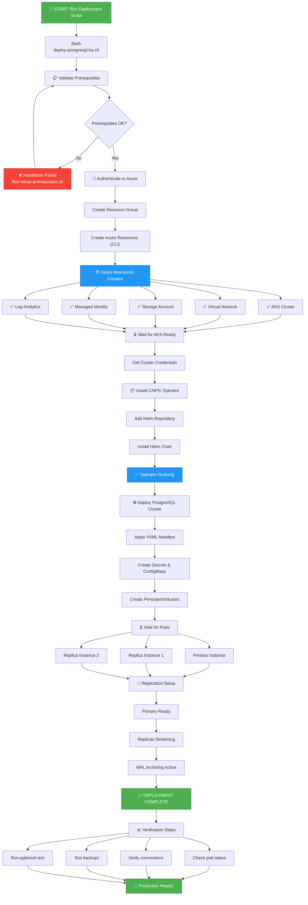

# Setup Complete ✅

Your Azure PostgreSQL HA on AKS Workshop project has been successfully created!

## 📦 What's Been Created

### Directory Structure
```
azure-postgresql-ha-aks-workshop/
├── .devcontainer/
│   ├── devcontainer.json              # Dev container configuration
│   └── generate-env.sh                # Auto-generates environment variables
├── .github/
│   └── copilot-instructions.md        # AI assistant guidance
├── config/
│   └── environment-variables.sh       # Environment configuration (loaded by scripts)
├── scripts/
│   ├── 02-create-infrastructure.sh    # Creates Azure resources (RG, AKS, Storage, Identity)
│   ├── 03-configure-workload-identity.sh # Federated credentials setup
│   ├── 04-deploy-cnpg-operator.sh     # Installs CNPG operator via Helm
│   ├── 05-deploy-postgresql-cluster.sh # Deploys PostgreSQL HA cluster
│   ├── 06-configure-monitoring.sh     # Configures Azure Monitor + Grafana
│   ├── 07-test-pgbench.sh             # Tests pgbench performance tool
│   ├── deploy-all.sh                  # ⭐ Master orchestration script (runs 02-06)
│   └── setup-prerequisites.sh         # Installs required tools
├── kubernetes/
│   └── postgresql-cluster.yaml        # Reference manifest (not directly used)
├── .env                               # Auto-generated environment variables (gitignored)
└── docs/
    └── README.md                      # Comprehensive documentation
```

### Key Files Explained:
- **`.env`**: Auto-generated on devcontainer startup with unique resource names
- **`config/environment-variables.sh`**: Template loaded by deployment scripts
- **`scripts/deploy-all.sh`**: ⭐ **Main deployment script** - orchestrates steps 02-06
- **Scripts 02-06**: Individual deployment phases using Azure CLI (not Bicep)

## 🔄 Deployment Flow



## �🚀 Getting Started

### Step 1: Install Prerequisites
Run the setup script to install all required tools:

**On macOS/Linux:**
```bash
chmod +x scripts/setup-prerequisites.sh
./scripts/setup-prerequisites.sh
```

**On Windows:**
Install manually or use Windows Subsystem for Linux (WSL):
- Azure CLI: https://learn.microsoft.com/cli/azure/install-azure-cli-windows
- kubectl: https://learn.microsoft.com/azure/aks/kubernetes-walkthrough#install-the-kubernetes-cli
- Helm: https://helm.sh/docs/intro/install/
- jq: https://stedolan.github.io/jq/download/
- OpenSSL: https://slproweb.com/products/Win32OpenSSL.html

### Step 2: Generate and Load Environment Variables

**In DevContainer (Auto-generated on startup):**
```bash
# Variables are auto-generated when devcontainer starts
# Load them in your terminal session:
source .env

# Verify loaded
echo "Resource Group: $RESOURCE_GROUP_NAME"
echo "AKS Cluster: $AKS_PRIMARY_CLUSTER_NAME"
echo "Storage Account: $PG_PRIMARY_STORAGE_ACCOUNT_NAME"
```

**Manual Generation (if needed):**
```bash
# Regenerate with new random suffix
rm .env
bash .devcontainer/generate-env.sh
source .env
```

**Or load from template:**
```bash
# Linux/Mac
source config/environment-variables.sh
```

**⚠️ Important:** Change the password before deployment:
```bash
export PG_DATABASE_PASSWORD="YourSecurePassword123!"
```

### Step 3: Deploy to Azure

**Authenticate to Azure:**
```bash
az login
az account show  # Verify subscription
```

**Run the master deployment script:**
```bash
# Ensure environment variables are loaded
source .env  # or source config/environment-variables.sh

# Run complete deployment (6 automated steps)
bash scripts/deploy-all.sh
```

This will execute all phases:
1. Create Azure infrastructure (Resource Group, AKS, Storage, Identity)
2. Configure Workload Identity with Federated Credentials
3. Deploy CloudNativePG operator via Helm
4. Deploy PostgreSQL HA cluster (3 instances)
5. Configure Azure Monitor and Grafana
6. Display connection information

### Step 4: Verify Deployment
```bash
# Get cluster credentials
az aks get-credentials --resource-group <rg-name> --name <cluster-name>

# Check PostgreSQL cluster status
kubectl cnpg status pg-primary -n cnpg-database

# Check pods are running
kubectl get pods -n cnpg-database -l cnpg.io/cluster=pg-primary

# View logs
kubectl logs -n cnpg-system deployment/cnpg-cloudnative-pg
```

## 📋 Key Features

✅ **3-Node High Availability**
- 1 Primary + 2 Synchronous Replicas
- Automatic failover across availability zones
- Zero-downtime promotion

✅ **Premium v2 Storage**
- Configurable IOPS (3100-40000)
- Configurable Throughput (125-1200 MB/s)
- Better price-performance than Premium SSD

✅ **Azure Integration**
- Workload Identity for secure authentication
- Azure Blob Storage backups with PITR
- Azure Monitor + Grafana monitoring
- Container insights enabled

✅ **Production Ready**
- SCRAM-SHA-256 authentication
- 7-day backup retention
- WAL compression with lz4
- Automated health checks

## 📊 Architecture Components

### Azure Infrastructure (Azure CLI)
- Resource Group with random suffix
- AKS cluster (1.32) with system and postgres node pools
- Managed identities with Workload Identity + Federated Credentials
- Log Analytics workspace
- Azure Monitor Workspace
- Managed Grafana instance
- Storage account for backups (ZRS)
- Network security configured automatically

### Kubernetes (CNPG)
- PostgreSQL 16 cluster (3 instances)
- Premium v2 StorageClass (4000 IOPS, 250 MB/s)
- Service accounts with Azure Workload Identity
- Monitoring via Prometheus + PodMonitor
- LoadBalancer services for external access (primary R/W, replicas R/O)

### Configuration (Environment Variables)
- All settings in `config/environment-variables.sh`
- Tuned PostgreSQL parameters (embedded in deployment script)
- 8GB memory per instance
- 4000 IOPS / 250 MB/s throughput
- Automated backups with 7-day retention

## 🔧 Customization

All configuration is in `config/environment-variables.sh`:

```bash
# Azure settings
PRIMARY_CLUSTER_REGION="canadacentral"        # Change region
AKS_CLUSTER_VERSION="1.32"                    # Change AKS version

# VM sizes
SYSTEM_NODE_POOL_VMSKU="Standard_D2s_v5"      # System pool VM
USER_NODE_POOL_VMSKU="Standard_D4s_v5"        # PostgreSQL pool VM

# Storage (Premium v2)
DISK_IOPS="4000"                              # Adjust IOPS (3100-40000)
DISK_THROUGHPUT="250"                         # Adjust throughput (125-1200 MB/s)
PG_STORAGE_SIZE="32Gi"                        # Adjust storage size

# PostgreSQL
PG_DATABASE_NAME="appdb"                      # Database name
PG_DATABASE_USER="app"                        # Database user
PG_DATABASE_PASSWORD="SecurePassword123!"     # CHANGE THIS!
PG_MEMORY="8Gi"                               # Memory per instance
PG_CPU="2"                                    # CPU per instance

# CNPG version
CNPG_VERSION="0.22.1"                         # CloudNativePG operator version
```

## 📚 Documentation

- **`docs/README.md`**: Complete deployment guide
- **`.github/copilot-instructions.md`**: AI assistant instructions
- **`config/environment-variables.sh`**: Configuration reference
- **`scripts/05-deploy-postgresql-cluster.sh`**: PostgreSQL cluster deployment with embedded configuration
- **`kubernetes/postgresql-cluster.yaml`**: Reference manifest (not used in actual deployment)

## 🔐 Security

- ✅ Workload Identity (no secrets in pods)
- ✅ SCRAM-SHA-256 password authentication
- ✅ Network Security Groups
- ✅ RBAC on AKS
- ✅ Encrypted backups at rest
- ✅ Isolation via Kubernetes namespaces

## 🚨 Important Before Deployment

1. **Environment Variables (DevContainer Auto-Generated)**:
   ```bash
   source .env  # Variables auto-created with unique suffix
   ```
   
   Or manually source template:
   ```bash
   source config/environment-variables.sh  # Linux/Mac
   ```

2. **Change PostgreSQL Password (REQUIRED)**:
   ```bash
   export PG_DATABASE_PASSWORD="YourSecurePassword123!"
   ```

3. **Review Region**:
   - Check `config/deployment-config.json` for region setting
   - Default: `canadacentral`
   - Verify Premium v2 disk support in your chosen region

4. **Azure Authentication**:
   ```bash
   az login
   az account show  # Verify correct subscription
   ```

5. **Configuration Review** (`config/deployment-config.json`):
   - AKS version (default: 1.32 - verify availability)
   - VM sizes (system: D2s_v5, user: D4s_v5)
   - Storage: Premium v2 with 4000 IOPS, 250 MB/s
   - PostgreSQL: 3 instances, 8GB RAM, 2 CPU each

6. **Public IP**:
   - Auto-detected when loading environment variables
   - Used for AKS API server access control

## ✅ Verification Checklist

After deployment, verify:

- [ ] AKS cluster created and running
- [ ] CNPG operator deployed
- [ ] PostgreSQL cluster has 3 healthy instances
- [ ] WAL archiving shows "OK"
- [ ] All pods running without errors
- [ ] Backups stored in Azure Blob Storage
- [ ] Grafana dashboard accessible
- [ ] Can connect to PostgreSQL (5432)

## 🆘 Need Help?

1. Check pod logs:
   ```bash
   kubectl logs -n cnpg-database <pod-name>
   ```

2. Describe cluster status:
   ```bash
   kubectl describe cluster pg-primary -n cnpg-database
   ```

3. View CNPG operator logs:
   ```bash
   kubectl logs -n cnpg-system deployment/cnpg-cloudnative-pg
   ```

4. Check Azure resources:
   ```bash
   az group show --name <resource-group-name>
   az aks list --resource-group <resource-group-name>
   ```

## 📖 Next Steps

1. **Load Environment Variables** (auto-generated in devcontainer):
   ```bash
   source .env
   ```

2. **Change PostgreSQL Password** (REQUIRED):
   ```bash
   export PG_DATABASE_PASSWORD="YourSecurePassword123!"
   ```

3. **Authenticate to Azure**:
   ```bash
   az login
   az account set --subscription "YOUR_SUBSCRIPTION_ID"  # if multiple subscriptions
   ```

4. **Review Configuration**:
   ```bash
   # Verify your settings
   echo "Resource Group: $RESOURCE_GROUP_NAME"
   echo "Region: $PRIMARY_CLUSTER_REGION"
   echo "AKS Cluster: $AKS_PRIMARY_CLUSTER_NAME"
   ```

5. **Deploy Everything**:
   ```bash
   bash scripts/deploy-all.sh
   ```

6. **Verify Deployment**:
   ```bash
   # Check cluster status
   kubectl cnpg status $PG_PRIMARY_CLUSTER_NAME -n $PG_NAMESPACE
   
   # Check pods
   kubectl get pods -n $PG_NAMESPACE
   ```

7. **Test Connection**:
   ```bash
   kubectl port-forward svc/${PG_PRIMARY_CLUSTER_NAME}-rw 5432:5432 -n ${PG_NAMESPACE}
   # In another terminal:
   psql -h localhost -U $PG_DATABASE_USER -d $PG_DATABASE_NAME
   ```

8. **Access Monitoring** (Grafana URL displayed after deployment):
   - View cluster metrics
   - Configure alerts
   - Monitor backups

## 🎓 Learning Resources

- CloudNativePG: https://cloudnative-pg.io/
- Azure AKS: https://learn.microsoft.com/azure/aks/
- Premium SSD v2: https://learn.microsoft.com/azure/virtual-machines/disks-types
- Well-Architected Framework: https://learn.microsoft.com/azure/architecture/framework/

---

**Project Ready!** 🎉

Your automation framework is complete and ready to deploy PostgreSQL HA on AKS.

Questions? Check the docs folder or review the inline comments in each file.
