# 🚀 Setup Complete Guide

**Version**: `v1.0.0` | **Last Updated**: October 2025

Your complete guide to deploying PostgreSQL HA on AKS with CloudNativePG operator.

## 📦 What's Been Created

### Directory Structure
```
azure-postgresql-ha-aks-workshop/
├── .devcontainer/
│   ├── devcontainer.json              # Dev container configuration
│   └── generate-env.sh                # Auto-generates environment variables
├── .github/
│   └── copilot-instructions.md        # AI assistant guidance
├── config/
│   └── environment-variables.sh       # Environment configuration (loaded by scripts)
├── scripts/
│   ├── 02-create-infrastructure.sh    # Creates Azure resources (RG, AKS, Storage, Identity, Bastion, NAT Gateway)
│   ├── 03-configure-workload-identity.sh # Federated credentials setup
│   ├── 04-deploy-cnpg-operator.sh     # Installs CNPG operator via Helm
│   ├── 04a-install-barman-cloud-plugin.sh # Installs Barman Cloud Plugin v0.8.0
│   ├── 04b-install-prometheus-operator.sh # Installs Prometheus Operator for metrics
│   ├── 05-deploy-postgresql-cluster.sh # Deploys PostgreSQL HA cluster + PgBouncer + PodMonitor
│   ├── 06-configure-monitoring.sh     # Configures Azure Monitor + Grafana
│   ├── 07-display-connection-info.sh  # Displays connection endpoints and credentials
│   ├── deploy-all.sh                  # ⭐ Master orchestration script (8 steps: 2, 3, 4, 4a, 4b, 5, 6, 7)
│   └── setup-prerequisites.sh         # Installs required tools
├── kubernetes/
│   ├── postgresql-cluster.yaml        # Reference manifest (not directly used)
│   ├── objectstore-azure-backup.yaml  # ObjectStore CRD for Barman Cloud Plugin
│   └── podmonitor-postgresql.yaml     # Manual PodMonitor for Prometheus metrics
├── .env                               # Auto-generated environment variables (gitignored)
└── docs/
    ├── README.md                      # Comprehensive documentation
    └── FAILOVER_TESTING.md            # Failover testing guide (scenarios & automation)
```

### Key Files Explained:
- **`.env`**: Auto-generated on devcontainer startup with unique resource names
- **`config/environment-variables.sh`**: Template loaded by deployment scripts
- **`scripts/deploy-all.sh`**: ⭐ **Main deployment script** - orchestrates 8 deployment steps
- **Scripts 02-07**: Individual deployment phases using Azure CLI and Helm
- **Script 04a**: Installs Barman Cloud Plugin v0.8.0 (required for backup/restore operations)
- **Script 04b**: Installs Prometheus Operator (provides PodMonitor CRD for metrics collection)
- **Script 05**: Deploys PostgreSQL cluster and configures it to use the Barman Cloud Plugin + PodMonitor
- **Script 07**: Displays connection information (direct PostgreSQL and PgBouncer pooler endpoints)

## 🔄 Deployment Flow

```mermaid
graph TD
    A["🚀 START: Run Deployment Script"] --> D["Bash<br/>deploy-all.sh"]
    
    D --> E["📋 Validate Prerequisites"]
    
    E --> E1{Prerequisites OK?}
    E1 -->|No| E2["❌ Installation Failed<br/>Run setup-prerequisites.sh"]
    E1 -->|Yes| F["🔐 Authenticate to Azure"]
    
    E2 --> E
    F --> F1["Create Resource Group"]
    F1 --> F2["Create Azure Resources (CLI)"]
    
    F2 --> G["🏗️ Azure Resources Created"]
    G --> G1["✅ AKS Cluster"]
    G --> G2["✅ Virtual Network"]
    G --> G3["✅ Storage Account"]
    G --> G4["✅ Managed Identity"]
    G --> G5["✅ Log Analytics"]
    
    G1 & G2 & G3 & G4 & G5 --> H["⏳ Wait for AKS Ready"]
    H --> H1["Get Cluster Credentials"]
    
    H1 --> I["📦 Install CNPG Operator"]
    I --> I1["Add Helm Repository"]
    I1 --> I2["Install Helm Chart"]
    I2 --> I3["✅ Operator Running"]
    
    I3 --> J["☸️ Deploy PostgreSQL Cluster"]
    J --> J1["Apply YAML Manifest"]
    J1 --> J2["Create Secrets & ConfigMaps"]
    J2 --> J3["Create PersistentVolumes"]
    
    J3 --> K["⏳ Wait for Pods"]
    K --> K1["Primary Instance"]
    K --> K2["Replica Instance 1"]
    K --> K3["Replica Instance 2"]
    
    K1 & K2 & K3 --> L["🔄 Replication Setup"]
    L --> L1["Primary Ready"]
    L1 --> L2["Replicas Streaming"]
    L2 --> L3["WAL Archiving Active"]
    
    L3 --> M["✅ DEPLOYMENT COMPLETE"]
    M --> N["📊 Verification Steps"]
    N --> N1["Run validation script"]
    N --> N2["Check pod status"]
    N --> N3["Verify connections"]
    N --> N4["Test backups"]
    N --> N5["Run pgbench test"]
    N1 & N2 & N3 & N4 & N5 --> O["🎉 Lab Setup Complete!"]
    
    style A fill:#4CAF50,stroke:#2E7D32,color:#fff
    style M fill:#4CAF50,stroke:#2E7D32,color:#fff
    style O fill:#4CAF50,stroke:#2E7D32,color:#fff
    style E2 fill:#f44336,stroke:#c62828,color:#fff
    style G fill:#2196F3,stroke:#1565c0,color:#fff
    style I3 fill:#2196F3,stroke:#1565c0,color:#fff
    style M fill:#4CAF50,stroke:#2E7D32,color:#fff
```



## �🚀 Getting Started

### Step 1: Install Prerequisites
Run the setup script to install all required tools:

**On macOS/Linux:**
```bash
chmod +x scripts/setup-prerequisites.sh
./scripts/setup-prerequisites.sh
```

**On Windows:**
Install manually or use Windows Subsystem for Linux (WSL):
- Azure CLI: https://learn.microsoft.com/en-us/cli/azure/install-azure-cli-windows
- kubectl: https://learn.microsoft.com/en-us/azure/aks/kubernetes-walkthrough#install-the-kubernetes-cli
- Helm: https://helm.sh/docs/intro/install/
- jq: https://stedolan.github.io/jq/download/
- OpenSSL: https://slproweb.com/products/Win32OpenSSL.html

### Step 2: Generate and Load Environment Variables

**In DevContainer (Auto-generated on startup):**
```bash
# Variables are auto-generated when devcontainer starts
# Load them in your terminal session:
source .env

# Verify loaded
echo "Resource Group: $RESOURCE_GROUP_NAME"
echo "AKS Cluster: $AKS_PRIMARY_CLUSTER_NAME"
echo "Storage Account: $PG_PRIMARY_STORAGE_ACCOUNT_NAME"
```

**Manual Generation (if needed):**
```bash
# Regenerate with new random suffix
rm .env
bash .devcontainer/generate-env.sh
source .env
```

**Or load from template:**
```bash
# Linux/Mac
source config/environment-variables.sh
```

**⚠️ Important:** Change the password before deployment:
```bash
export PG_DATABASE_PASSWORD="YourSecurePassword123!"
```

### Step 3: Deploy to Azure

**Authenticate to Azure:**
```bash
az login
az account show  # Verify subscription
```

**Run the master deployment script:**
```bash
# Ensure environment variables are loaded
source .env  # or source config/environment-variables.sh

# Run complete deployment (7 automated steps)
bash scripts/deploy-all.sh
```

This will execute all phases:
1. Create Azure infrastructure (Resource Group, AKS, Storage, Identity, VM Subnet)
2. Configure Workload Identity with Federated Credentials
3. Deploy CloudNativePG operator via Helm (1.27.1)
4. Install Barman Cloud Plugin v0.8.0 (modern backup architecture)
5. Deploy PostgreSQL HA cluster (3 instances + 3 PgBouncer poolers)
6. Configure Azure Monitor and Grafana
7. Display connection information

### Step 4: Validate Deployment (Recommended ⭐)
```bash
# Run comprehensive validation script (20+ tests)
./scripts/07a-validate-cluster.sh
```

**What gets validated:**
- ✅ Cluster status and HA configuration (3/3 instances ready)
- ✅ Multi-zone pod distribution (across 3 availability zones)
- ✅ Service endpoints (rw, ro, pooler services)
- ✅ PostgreSQL connectivity (primary via PgBouncer)
- ✅ Data write operations (table creation, inserts)
- ✅ Synchronous replication (RPO=0 validation)
- ✅ Data consistency (primary vs replica comparison)
- ✅ PgBouncer pooler (3 instances, transaction mode)
- ✅ WAL archiving and backups (Barman plugin)
- ✅ Monitoring configuration (PodMonitor, metrics)

**Expected Output:**
```
========================================
Validation Summary
========================================

Total Tests:     20
Tests Passed:    16-20
Tests Failed:    0-4
Warnings:        0-6
Pass Rate:       80-100%

✅ ALL TESTS PASSED
PostgreSQL HA Cluster is fully operational!
```

### Step 5: Manual Verification (Optional)
```bash
# Get cluster credentials
az aks get-credentials --resource-group <rg-name> --name <cluster-name>

# Check PostgreSQL cluster status
kubectl cnpg status pg-primary -n cnpg-database

# Check all pods (PostgreSQL + PgBouncer)
kubectl get pods -n cnpg-database

# Expected pods:
# - 3x pg-primary-X (PostgreSQL instances)
# - 3x pg-primary-pooler-XXXX (PgBouncer poolers)

# View logs
kubectl logs -n cnpg-system deployment/cnpg-cloudnative-pg
```

### Step 6: Test Connections
```bash
# Test via PgBouncer pooler (Recommended for applications)
kubectl port-forward svc/pg-primary-pooler-rw 5432:5432 -n cnpg-database &
psql -h localhost -U app -d appdb

# Test direct PostgreSQL connection (For admin tasks)
kubectl port-forward svc/pg-primary-rw 5433:5432 -n cnpg-database &
psql -h localhost -p 5433 -U app -d appdb
```

### Step 7: Run Performance Tests
```bash
# Run comprehensive pgbench test (tests both direct and pooler)
./scripts/08-test-pgbench.sh

# Expected output:
# - Phase 1: Connection verification (both endpoints)
# - Phase 2: Schema initialization (scale 10 = ~160MB)
# - Phase 3: Direct connection performance test (30s)
# - Phase 4: Pooler connection performance test (30s)
# - Phase 5: Cleanup
```

## 📋 Key Features

✅ **3-Node High Availability**
- 1 Primary + 1 Quorum Sync Replica + 1 Async Replica
- Automatic failover across availability zones (<10s target)
- Synchronous quorum replication (RPO = 0, zero data loss)

✅ **Connection Pooling with PgBouncer**
- 3 PgBouncer instances in transaction mode
- 10,000 max client connections per instance (30K total capacity)
- 25 default pool size per user/database
- Pod anti-affinity for high availability

✅ **Premium v2 Storage (Optimized for 10K TPS)**
- 40,000 IOPS per disk (configurable 3100-80000)
- 1,250 MB/s throughput per disk (configurable 125-1200 MB/s)
- 200 GiB per instance
- Better price-performance than Premium SSD

✅ **Enterprise-Grade Hardware**
- Standard_E8as_v6 nodes (8 vCPU, 64 GiB RAM, AMD EPYC 9004)
- PostgreSQL 17.0 with CloudNativePG 1.27.1
- 48 GiB RAM, 6 vCPU per PostgreSQL instance
- Azure Linux (CBL-Mariner) node OS

✅ **Modern Backup Architecture**
- Barman Cloud Plugin v0.8.0 (no deprecated features)
- Azure Blob Storage with Workload Identity authentication
- 7-day retention with point-in-time recovery (PITR)
- WAL compression with gzip, 4 parallel streams
- ObjectStore CRD for better separation of concerns

✅ **Azure Integration**
- Workload Identity for secure authentication
- Manual PodMonitor for Prometheus metrics
- Azure Monitor + Grafana monitoring
- Container insights enabled

✅ **Lab & PoC Ready**
- SCRAM-SHA-256 authentication
- Optimized PostgreSQL parameters for E8as_v6
- Failover optimization (5s delays, 3s probe timeouts)
- Automated health checks
- CNPG 1.29.0+ compatible (zero deprecated configurations)

> **Note**: This configuration is designed for lab and proof-of-concept purposes. Additional security hardening, compliance validation, and operational procedures are required for production use.

## 📊 Architecture Components

### Azure Infrastructure (Azure CLI)
- Resource Group with random suffix
- AKS cluster (1.32) with Azure Linux node pools:
  - System pool: 2 × Standard_D2s_v5
  - PostgreSQL pool: 3 × Standard_E8as_v6 (8 vCPU, 64 GiB RAM)
- Managed identities with Workload Identity + Federated Credentials
- Log Analytics workspace
- Azure Monitor Workspace
- Managed Grafana instance
- Storage account for backups (ZRS)
- Network security configured automatically

### Kubernetes (CNPG 1.27.1)
- PostgreSQL 17 cluster (3 instances)
- PgBouncer pooler (3 instances, transaction mode)
- Premium v2 StorageClass (40,000 IOPS, 1,250 MB/s per disk)
- Service accounts with Azure Workload Identity
- Manual PodMonitor for Prometheus metrics
- 4 Service endpoints:
  - `pg-primary-pooler-rw` (PgBouncer read-write) ← **Recommended for apps**
  - `pg-primary-pooler-ro` (PgBouncer read-only)
  - `pg-primary-rw` (Direct read-write)
  - `pg-primary-ro` (Direct read-only)

### Backup Architecture (Modern Plugin-Based)
- Barman Cloud Plugin v0.8.0
- ObjectStore CRD for Azure Blob configuration
- Gzip compression with 4 parallel WAL streams
- 7-day retention with PITR
- No deprecated configurations (CNPG 1.29+ ready)

### Configuration (Environment Variables)
- All settings in `config/environment-variables.sh`
- Tuned PostgreSQL parameters for E8as_v6:
  - shared_buffers: 16GB
  - effective_cache_size: 48GB
  - work_mem: 64MB
  - max_worker_processes: 12
  - Optimized for 40K IOPS storage
- Resource allocation: 48 GiB RAM, 6 vCPU per instance
- Target performance: 8,000-10,000 TPS sustained

## 🔧 Customization

All configuration is in `config/environment-variables.sh`:

```bash
# Azure settings
PRIMARY_CLUSTER_REGION="swedencentral"        # Change region
AKS_CLUSTER_VERSION="1.32"                    # Change AKS version

# VM sizes (Optimized for 10K TPS)
SYSTEM_NODE_POOL_VMSKU="Standard_D2s_v5"      # System pool VM
USER_NODE_POOL_VMSKU="Standard_E8as_v6"       # PostgreSQL pool VM (8 vCPU, 64 GiB)

# Storage (Premium v2 - High Performance)
DISK_IOPS="40000"                             # Adjust IOPS (3100-80000)
DISK_THROUGHPUT="1250"                        # Adjust throughput (125-1200 MB/s)
PG_STORAGE_SIZE="200Gi"                       # Adjust storage size

# PostgreSQL (Tuned for E8as_v6)
PG_DATABASE_NAME="appdb"                      # Database name
PG_DATABASE_USER="app"                        # Database user
PG_DATABASE_PASSWORD="SecurePassword123!"     # CHANGE THIS!
PG_MEMORY="48Gi"                              # Memory per instance (75% of 64GB)
PG_CPU="6"                                    # CPU per instance (75% of 8 vCPU)

# PgBouncer Pooler
PG_POOLER_INSTANCES="3"                       # Number of pooler pods
PG_POOLER_MAX_CONN="10000"                    # Max client connections per instance
PG_POOLER_POOL_SIZE="25"                      # Default pool size per user/database

# CNPG version
CNPG_VERSION="0.26.1"                         # CloudNativePG Helm chart version (operator 1.27.1)
```

## 📚 Documentation

- **`docs/README.md`**: Complete deployment guide
- **`docs/FAILOVER_TESTING.md`**: Comprehensive failover testing scenarios (manual + automated)
- **`.github/copilot-instructions.md`**: AI assistant instructions
- **`config/environment-variables.sh`**: Configuration reference
- **`scripts/05-deploy-postgresql-cluster.sh`**: PostgreSQL cluster deployment with embedded configuration
- **`kubernetes/postgresql-cluster.yaml`**: Reference manifest (not used in actual deployment)
- **`kubernetes/objectstore-azure-backup.yaml`**: ObjectStore CRD for Barman Cloud Plugin
- **`kubernetes/podmonitor-postgresql.yaml`**: Manual PodMonitor for Prometheus metrics

## 🔐 Security

- ✅ Workload Identity (no secrets in pods)
- ✅ SCRAM-SHA-256 password authentication
- ✅ Network Security Groups
- ✅ RBAC on AKS
- ✅ Encrypted backups at rest
- ✅ Isolation via Kubernetes namespaces

## 🚨 Important Before Deployment

1. **Environment Variables (DevContainer Auto-Generated)**:
   ```bash
   source .env  # Variables auto-created with unique suffix
   ```
   
   Or manually source template:
   ```bash
   source config/environment-variables.sh  # Linux/Mac
   ```

2. **Change PostgreSQL Password (REQUIRED)**:
   ```bash
   export PG_DATABASE_PASSWORD="YourSecurePassword123!"
   ```

3. **Review Region**:
   - Check `config/environment-variables.sh` for region setting
   - Default: `eastus2`
   - Verify Premium v2 disk support in your chosen region

4. **Azure Authentication**:
   ```bash
   az login
   az account show  # Verify correct subscription
   ```

5. **Configuration Review** (`config/environment-variables.sh`):
   - AKS version (default: 1.32 - verify availability)
   - VM sizes (system: D2s_v5, user: E8as_v6 - 8 vCPU, 64 GiB RAM)
   - Storage: Premium v2 with 40,000 IOPS, 1,250 MB/s
   - PostgreSQL: 3 instances, 48 GiB RAM, 6 vCPU each
   - PgBouncer: 3 instances, 10K max connections each
   - Target performance: 8,000-10,000 TPS

6. **Public IP**:
   - Auto-detected when loading environment variables
   - Used for AKS API server access control

## ✅ Verification Checklist

After deployment, verify:

- [ ] AKS cluster created with Azure Linux nodes
- [ ] CNPG operator deployed (1.27.1)
- [ ] Barman Cloud Plugin installed (v0.8.0)
- [ ] PostgreSQL cluster has 3 healthy instances
- [ ] PgBouncer pooler has 3 healthy pods
- [ ] WAL archiving shows "OK"
- [ ] All pods running without errors
- [ ] ObjectStore CRD deployed and configured
- [ ] Manual PodMonitor created for metrics
- [ ] Backups stored in Azure Blob Storage
- [ ] Grafana dashboard accessible
- [ ] Can connect via pooler (recommended): `pg-primary-pooler-rw:5432`
- [ ] Can connect direct (admin): `pg-primary-rw:5432`
- [ ] pgbench tests pass (both direct and pooler)
- [ ] Zero deprecated configurations (CNPG 1.29+ ready)

## 🆘 Need Help?

1. Check pod logs:
   ```bash
   kubectl logs -n cnpg-database <pod-name>
   ```

2. Describe cluster status:
   ```bash
   kubectl describe cluster pg-primary -n cnpg-database
   ```

3. View CNPG operator logs:
   ```bash
   kubectl logs -n cnpg-system deployment/cnpg-cloudnative-pg
   ```

4. Check Azure resources:
   ```bash
   az group show --name <resource-group-name>
   az aks list --resource-group <resource-group-name>
   ```

## 📖 Next Steps

1. **Load Environment Variables** (auto-generated in devcontainer):
   ```bash
   source .env
   ```

2. **Change PostgreSQL Password** (REQUIRED):
   ```bash
   export PG_DATABASE_PASSWORD="YourSecurePassword123!"
   ```

3. **Authenticate to Azure**:
   ```bash
   az login
   az account set --subscription "YOUR_SUBSCRIPTION_ID"  # if multiple subscriptions
   ```

4. **Review Configuration**:
   ```bash
   # Verify your settings
   echo "Resource Group: $RESOURCE_GROUP_NAME"
   echo "Region: $PRIMARY_CLUSTER_REGION"
   echo "AKS Cluster: $AKS_PRIMARY_CLUSTER_NAME"
   ```

5. **Deploy Everything**:
   ```bash
   bash scripts/deploy-all.sh
   ```

6. **Verify Deployment**:
   ```bash
   # Check cluster status
   kubectl cnpg status $PG_PRIMARY_CLUSTER_NAME -n $PG_NAMESPACE
   
   # Check pods
   kubectl get pods -n $PG_NAMESPACE
   ```

7. **Test Connection**:
   ```bash
   # Via PgBouncer pooler (Recommended)
   kubectl port-forward svc/${PG_PRIMARY_CLUSTER_NAME}-pooler-rw 5432:5432 -n ${PG_NAMESPACE} &
   psql -h localhost -U $PG_DATABASE_USER -d $PG_DATABASE_NAME
   
   # Direct PostgreSQL (Admin tasks)
   kubectl port-forward svc/${PG_PRIMARY_CLUSTER_NAME}-rw 5433:5432 -n ${PG_NAMESPACE} &
   psql -h localhost -p 5433 -U $PG_DATABASE_USER -d $PG_DATABASE_NAME
   ```

8. **Run Performance Tests**:
   ```bash
   # Comprehensive test (direct + pooler)
   ./scripts/08-test-pgbench.sh
   ```

9. **Access Monitoring** (Grafana URL displayed after deployment):
   - View cluster metrics
   - Monitor PgBouncer connection pools
   - Configure alerts
   - Monitor backups

10. **Test Failover** (Optional):
    ```bash
    # See docs/FAILOVER_TESTING.md for comprehensive failover testing guide
    # Tests both manual promotion and simulated failures
    # Compares direct vs pooler connection behavior
    ```

## 🎓 Learning Resources

- CloudNativePG: https://cloudnative-pg.io/
- Azure AKS: https://learn.microsoft.com/en-us/azure/aks/
- Premium SSD v2: https://learn.microsoft.com/en-us/azure/virtual-machines/disks-types
- Well-Architected Framework: https://learn.microsoft.com/en-us/azure/architecture/framework/

---

**Project Ready!** 🎉

Your automation framework is complete and ready to deploy PostgreSQL HA on AKS.

Questions? Check the docs folder or review the inline comments in each file.
